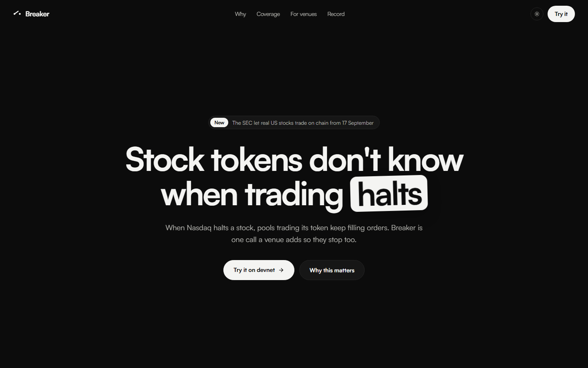
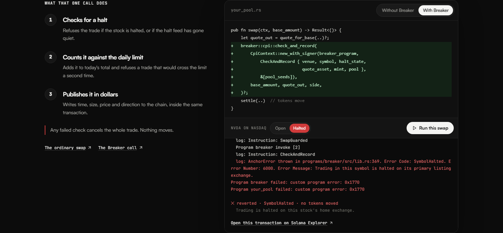
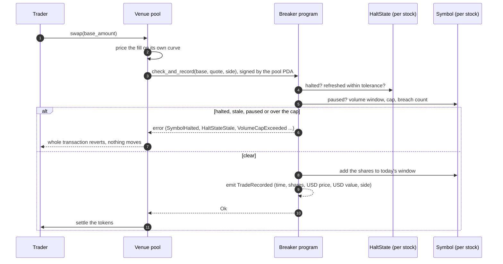
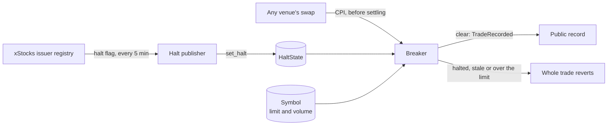
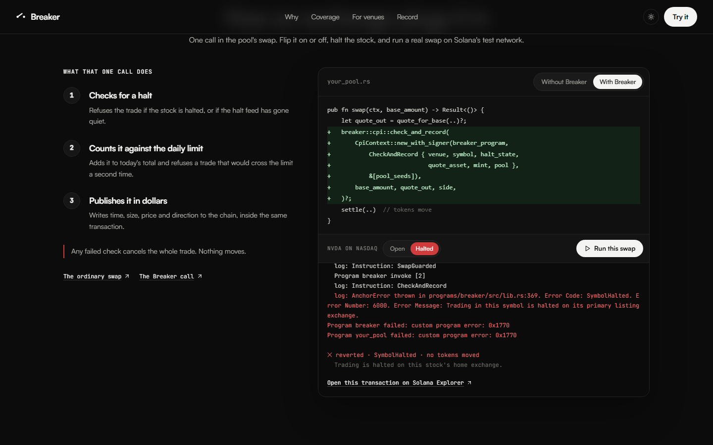

<p align="center">
  
</p>

<h1 align="center">Breaker</h1>

<p align="center">
  <b>Halt protection for tokenized stocks on Solana.</b><br>
  One call a trading venue adds, so halted stocks stop trading, daily limits hold, and every trade is published.
</p>

<p align="center">
  <a href="https://breaker-one.vercel.app"></a>
  <a href="https://explorer.solana.com/address/EdTGUwJPq5RNy4RjLRzKYbajtkDzaim3MYiPi8yB9obe?cluster=devnet"></a>
  <a href="https://github.com/jenzylove/breaker/actions/workflows/verify.yml"></a>
  <a href="https://github.com/jenzylove/breaker/actions/workflows/halt-publisher.yml"></a>
  <a href="https://hackathons.solana.com/hackathons/stocklana"></a>
  <a href="https://x.com/breakersec"></a>
</p>

<p align="center">
  
</p>

On 17 September 2026 the SEC issued an order granting temporary conditional exemptive relief under
Section 36(a)(1) of the Exchange Act. For the first time, tokenized NMS stocks may trade through AMM
liquidity pools on public permissionless blockchains, under a five year exemption from the definition
of "exchange".

It comes with conditions. Three of them are things no AMM does.

A pool does not know that Nasdaq halted a stock, because the entire premise of an automated market
maker is that it never closes. A pool does not know what 0.25% of last month's average daily volume
is, or how much of it today's trading has already consumed. And a pool emits raw token amounts, not
the dollar denominated tape the order requires to be public within ten minutes of every fill.

The issuer's halt does not reach the chain on its own either. On 24 September 2026 xStocks had seven
stocks halted, and none of their Solana mints had the Token-2022 pause set, so every one of them stayed
freely tradable in any pool.

Breaker is the call a venue makes before it settles.

<p align="center">
  
  <br><sub>The live demo: the Breaker call switched on, NVIDIA halted, and the real devnet swap reverting with <code>SymbolHalted</code> in the program's own logs.</sub>
</p>

| | |
|---|---|
| Live site | https://breaker-one.vercel.app |
| Breaker program (devnet) | [`EdTGUwJPq5RNy4RjLRzKYbajtkDzaim3MYiPi8yB9obe`](https://explorer.solana.com/address/EdTGUwJPq5RNy4RjLRzKYbajtkDzaim3MYiPi8yB9obe?cluster=devnet) |
| Reference pool (devnet) | [`4EWRfxyMmze3F3e9Lff84PK1W9L7EFGdKa147icdJLxU`](https://explorer.solana.com/address/4EWRfxyMmze3F3e9Lff84PK1W9L7EFGdKa147icdJLxU?cluster=devnet) |
| Live stock status (issuer registry) | [`/api/stocks`](https://breaker-one.vercel.app/api/stocks) |
| Public trade record | [`/api/tape`](https://breaker-one.vercel.app/api/tape) |

---

## How it works

A venue's swap calls Breaker through CPI before any token moves. Breaker either records the trade or
returns an error, and the swap's `?` turns that error into a revert of the whole transaction.



Where the inputs come from, and where each trade ends up:



The halt publisher, the ADV publisher and the operator are separate roles named when the venue is
created, so a venue can keep the party that profits from trading apart from the party that says whether
trading is allowed. The test venue uses one key for all three.

## Integrations

| Service | How Breaker uses it |
|---|---|
| [Solana](https://solana.com) | The Breaker program and the reference pool (Anchor 1.2) on devnet. Token-2022 mint extensions: Scaled UI Amount for the share count, Pausable for the issuer's own freeze. |
| [xStocks](https://xstocks.fi) | The public issuer registry: halt flag, trading period and mint for all 1,124 tokens. The halt publisher mirrors it and the coverage table reads it live. |
| [Helius](https://www.helius.dev) | RPC for the devnet transactions and the public record. Mainnet reads of the real xStocks mints use Solana's public RPC. |
| [Vercel](https://vercel.com) | Hosts the site and the edge and Node API routes. |
| [GitHub Actions](https://github.com/features/actions) | Runs the test suites on every push and the halt publisher every five minutes. |

---

## Add Breaker to a venue

Breaker is not somewhere anyone trades. It is a program that a venue's own swap calls through CPI,
the same way a protocol reads a Pyth price from inside its own instruction. Three steps.

**1. Register the venue.** `initialize_venue` names the venue's halt publisher and ADV publisher.
Those are separate keys from the operator, usually a service mirroring the issuer's feed.

**2. List what it trades.** `list_symbol` per tokenized stock, with its tier (1 or 2). Breaker reads
the mint and refuses anything that is not a Token-2022 mint with the Scaled UI Amount extension, so
a venue cannot list a token it mislabels. `register_quote_asset` tells it how to value the quote side
in dollars.

**3. Add one call before settlement.** This is the complete difference between the two swaps in
[`programs/reference-pool/src/lib.rs`](programs/reference-pool/src/lib.rs), and the only change a
pool needs:

```diff
 pub fn swap(ctx, base_amount) -> Result<()> {
     let quote_out = quote_for_base(..)?;

+    breaker::cpi::check_and_record(
+        CpiContext::new_with_signer(
+            breaker_program,
+            CheckAndRecord { venue, symbol, halt_state, quote_asset, mint, pool },
+            &[pool_seeds],
+        ),
+        base_amount, quote_out, side,
+    )?;

     settle(..)  // tokens move only if the check passed
 }
```

That call does three things inside the same transaction:

1. **Checks the halt.** Refuses if the stock is halted, or if the halt flag has not been refreshed
   within the venue's tolerance, so a silent publisher fails closed.
2. **Counts the trade.** Adds it to the stock's rolling 24 hour share volume. The first crossing of the
   cap settles and is flagged, as the order allows. Later crossings are refused.
3. **Publishes it.** Emits `TradeRecorded` with the time, share size, dollar price, dollar value and
   direction. The public record is rebuilt from these events.

If any check fails the CPI returns an error, the swap's `?` propagates it, and the whole transaction
reverts. Nothing moves.

| Code | Error | When |
|---|---|---|
| 6000 | `SymbolHalted` | The stock is halted on its listing exchange |
| 6001 | `HaltStateStale` | The halt feed is older than the venue's tolerance |
| 6002 | `SymbolPausedForBreach` | The stock is inside a three month pause |
| 6003 | `VolumeCapExceeded` | The trade would cross the cap a second time |
| 6004 | `AdvUnset` | No volume figure has been published for the stock |
| 6009 | `IssuerPaused` | The issuer has paused the mint |
| 6011 | `VenuePaused` | The venue operator has paused trading |

`side` is from the pool's point of view: `0` when the pool sold the equity token, `1` when it bought
it. The pool must sign the CPI with its own seeds, so no one can write trades into the record on
another pool's behalf.

---

## Where the halts come from

The halt flag is only as good as its publisher, so the publisher does not decide anything. It mirrors
the issuer. xStocks publishes a registry of every tokenized stock it issues, 1,124 of them with a
Solana mint, and each entry carries the issuer's own `isTradingHalted` flag and trading period.
[`api/heartbeat.ts`](api/heartbeat.ts) reads that flag for each listed stock and writes it on chain.
If the registry cannot be read, it publishes nothing, the feed ages past its tolerance, and Breaker
refuses trades rather than guessing.

An issuer halt does not reach the chain by itself. On 24 September 2026 xStocks had seven stocks
halted, and none of their mints had the Token-2022 pause set, so each token stayed freely tradable in
any pool. [`scripts/check-issuer-pause.mjs`](scripts/check-issuer-pause.mjs) re-runs that check
against mainnet.

The site's coverage table reads the same registry live ([`api/stocks.ts`](api/stocks.ts)), so the
halted count on the page is the issuer's count, not ours.

---

## The site

https://breaker-one.vercel.app runs against devnet and needs no wallet.

- **For venues** is the demo. The integration code has a switch that adds or removes the Breaker
  call, another that sets NVIDIA open or halted, and a button that runs a real swap on devnet from
  the test venue's key. The program's own logs stream back under the code, and a cleared trade is
  decoded from its `TradeRecorded` event. A halted run is one atomic transaction that raises the
  halt, trades and lowers it, so nothing is left in a staged state; an open run publishes whatever
  the issuer currently says.
- **Coverage** lists all 1,124 xStocks tokens with the issuer's live status, and counts how many of
  the halted ones are actually paused on Solana, read from mainnet on each visit.
- **Record** is rebuilt from chain logs on each load.

<p align="center">
  
</p>

## What the order requires, and what Breaker does about it

**1. Stop when the exchange stops.** A venue must halt a tokenized stock concurrently with any halt
or suspension of the underlying on its primary listing exchange.

`check_and_record` reads a halt account published by the venue's nominated halt publisher and reverts
the parent transaction if the symbol is halted. It also reverts if that feed has gone stale, because
a venue that cannot prove it is mirroring the listing exchange does not get to keep trading on the
assumption that it is. The program defaults to a 120 second tolerance and caps any venue's tolerance
at one hour, so the check cannot be configured away.

The issuer's own Token-2022 pause is treated as a halt too. It is a stoppage the listing exchange
never sees, and a venue that only mirrors Nasdaq would keep trading a token the issuer had frozen.

**2. Stay under the volume cap.** Tier 1 symbols are capped at 0.25% of the prior month's average
daily share volume, Tier 2 at 2.5%. A venue may list at most 75 Tier 1 and 250 Tier 2 symbols. The
first exceedance requires no action; any later one forces an immediate three month pause in that
symbol.

The program tracks a rolling 24 hour share volume window per symbol against a published ADV figure.
The first crossing settles and is recorded, exactly as the order allows. **Every crossing after that
is refused rather than allowed and then punished.** A venue that can prevent a second breach should
never incur one. `report_breach` still applies the three month pause for breaches that happened at an
affiliated venue this program cannot observe.

**3. Publish the dollar tape.** Transaction data must be freely and publicly available in machine
readable form within ten minutes of every fill, carrying symbol, price, size, UTC timestamp,
direction and pool details.

Every settled fill emits a `TradeRecorded` event. `/api/tape` rebuilds those rows from chain logs on
every request, so the tape is current to the last confirmed slot rather than to whenever an indexer
last ran. Nothing in it is privileged: the same rows can be reconstructed by anyone reading the
program's logs, which is what makes the tape verifiable rather than merely published.

---

## The share count problem

The cap is denominated in **shares**. The tape is denominated in **dollars**. Neither is the raw
token amount a pool moves.

Tokenized equities use the Token-2022 Scaled UI Amount extension, which carries *two* multipliers and
an activation timestamp. Once that timestamp passes, the live multiplier is the one that is **not**
in the obvious field. This is not hypothetical. It is the live state of real mints today.

The devnet run activates exactly that condition mid flight:

```
stored multiplier     1.0
effective multiplier  1.4861347
understatement if the stored field is read   48.61%
```

A venue reading the obvious field would have understated every fill by 48.61%, breaching its own
regulatory volume cap without knowing and filing a dollar tape that was wrong by the same margin.

---

## Proof on devnet

Every transaction below is openable. The reverts landed on chain rather than being rejected at
preflight, because a revert that only ever existed in a simulation proves nothing.

### Same pool, same curve, one call apart

While TSLAx was halted on its listing exchange, the same swap ran twice against the same reference
pool.

| | Result | |
|---|---|---|
| `swap_unguarded` | **Settled $29,120.56** against a halted stock | [tx](https://explorer.solana.com/tx/3QhzEjBNTz55YebUragBMYrchQWkRoZuf6ZvqZe5BCoQrPshU1TCPUFA5WAeDgaRUvBnTPAT5fQbmJgRosxydBf1?cluster=devnet) |
| `swap_guarded` | **Reverted**, `SymbolHalted` (6000), 0 funds moved | [tx](https://explorer.solana.com/tx/2ZFXgvtEWJkaEaXKtizGJLkLTdXg8YstqRykLcC5a9eL7gsfh8QgN2VoiRZFSwyA2zJMqZTxSsSYm6LZt7cBfwTX?cluster=devnet) |

The unguarded path is not a strawman. It is how every AMM on Solana behaves today, because a pool
cannot see a listing exchange.

### Walking the volume cap

Cap 200 shares, 148.61 shares per fill.

| Fill | Result | |
|---|---|---|
| 1 | Settled: first exceedance, allowed by the order and recorded | [tx](https://explorer.solana.com/tx/4M8yUTxUSkBBrdxB4eQUBTF7LtDnivCi6Nv1vaFVHy5xPwZAt46B8UgpDpMb9ZppbtwHBBhndvb76siXEw7t1DVB?cluster=devnet) |
| 2 | **Reverted**, `VolumeCapExceeded` (6003) | [tx](https://explorer.solana.com/tx/2Z2BhF97pU4gBG4G9mEe8ajUy8XKtr5kenjPFMeqGPva1HTrBJ8i2xRtTX1qDSVXzY1kaVNQoWNTBv3529X6948o?cluster=devnet) |

Full artifact with all 15 steps: [`docs/devnet-proof.json`](docs/devnet-proof.json).

---

## Architecture

```
programs/breaker/          the guard a venue calls before it settles
programs/reference-pool/   a constant product pool, with and without the guard
crates/breaker-core/       the compliance arithmetic, no Solana dependencies
src/                       the site
api/stocks.ts              live status of every xStocks token, from the issuer
api/heartbeat.ts           the halt publisher, mirroring the issuer's flag
api/demo.ts                runs the demo swaps from the test venue's key
.github/workflows/         tests on every push; the halt publisher every five minutes
api/tape.ts                the public record, rebuilt from chain logs
```

**`breaker-core`** holds the cap and halt rules as pure functions with no Solana dependencies, so the
arithmetic is testable directly. 18 tests cover the tier percentages, window rollover, the exact cap
boundary, the first exceedance allowance, staleness failing closed, and the multiplier resolution pinned
to real mint values.

**The reference pool** exposes `swap_unguarded` and `swap_guarded` running identical curve maths. One
settles whenever the curve allows; the other calls Breaker first. They exist side by side so the
difference is demonstrable on chain rather than asserted here.

**Accounts.** A `Venue` nominates a halt publisher and an ADV publisher. Each listed `Symbol` carries
its tier, ADV, volume window, breach count and pause. A separate `HaltState` per symbol is written by
the halt publisher alone, keeping write authority split from the venue operator.

**The pool signs.** `check_and_record` takes the pool as a `Signer`, so a tape entry cannot be forged
on another pool's behalf.

---

## Reproduce it

```bash
# Rust workspace: the compliance arithmetic
cargo test --workspace

# Frontend: tape decoding and dashboard state
npm install && npm test

# Build both programs to SBF, then run a local validator
bash scripts/wsl-build.sh
bash scripts/wsl-localnet.sh

# Walk all three conditions end to end
node scripts/proof-run.mjs

# Or against the live devnet deployment
SOLANA_RPC_URL=https://api.devnet.solana.com node scripts/proof-run.mjs

# Rebuild the tape from chain and reconcile every dollar figure
npx tsx scripts/verify-tape.mjs
```

`verify-tape.mjs` checks the decoder against real chain data rather than fixtures, and asserts that
every dollar figure on the tape recomputes from the raw amounts. Field order bugs survive hand
written fixtures; they do not survive that.

---

## Scope and limits

Stated plainly, because a compliance tool that overstates itself is worse than none.

- **Breaker is not a venue.** It is the check a venue calls. Running it does not make anyone a
  Tokenized Securities Venue, and nothing here constitutes legal advice.
- **Halt state and ADV are attested inputs.** Both originate off chain, so both are published by
  roles the venue nominates. The program enforces freshness and authority on them, not truth.
- **The order aggregates volume caps across affiliated venues.** This implementation enforces one
  venue's own volume.
- **Devnet only.** Not audited, and not deployed to mainnet.
- **Breaker covers three conditions of the order, not all of them.** Permissioned access, issuer
  objection rights, published venue contracts, participant notices, OFAC and recordkeeping are the
  venue's to meet.
- **The test venue's halt tolerance is fifteen minutes.** Its publisher runs every five minutes on
  GitHub Actions, whose schedule can lag, so the tolerance leaves room for a late run. A production
  publisher would write every few seconds against the program's 120 second default. The check cannot
  be disabled.
- **The first trades on the record carry the wrong direction.** The reference pool passed side `0`
  for a swap in which the pool bought the equity token. It was corrected and redeployed on 24
  September 2026 (devnet slot 503651120). Records on chain cannot be edited, so trades before that
  slot read "buy" where the taker sold.

---

## The order

Order Granting Temporary Conditional Exemptive Relief, Pursuant to Section 36(a)(1) of the Securities
Exchange Act of 1934, From the Definition of "Exchange" in Section 3(a)(1) for the Use of Certain
Distributed Ledger Trading Venues for Tokenized NMS Stocks. Effective 17 September 2026, expiring 17
September 2031.
[Federal Register, 22 September 2026](https://www.federalregister.gov/documents/2026/09/22/2026-19388/order-granting-temporary-conditional-exemptive-relief-pursuant-to-section-36a1-of-the-securities).
